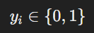

# Methodology

## Predictive Models

### Data cleaning

The data cleaning process involved several steps to prepare and integrate data from different sources for analysis. Initially, raw data from traction and spectrochemical analyses, made by the company, were imported from Excel files. Spectrochemical data was filtered to retain only relevant measurements and columns, removing rows with missing values and focusing on specific measurement types. Columns with inconsistent naming were standardized, and unnecessary columns were dropped.

Traction data was similarly cleaned by renaming columns for consistency and correcting format discrepancies. Numeric columns were converted to the appropriate data types, and invalid entries were removed. Both datasets were aggregated to compute mean values where necessary, followed by merging based on common identifiers such as furnace number and nuance.

Duplicate records were eliminated to ensure uniqueness. The final cleaned dataset contains each observations chemical compositions (explicative features) and the traction results (value to predict).
This dataset was saved in an Excel file, ready for further analysis.
### Overview

The predictive modeling process estimates the mechanical properties of materials using **Random Forest algorithms**. This ensemble learning method constructs multiple decision trees and aggregates their results to make predictions. It is well-suited for handling complex and non-linear relationships in data which is our case. 

### Model Generation

1. **Data Preparation**:
   - **Import Data**: The cleaned dataset (data_nettoyées.xlsx) is loaded.
   - **Feature and Target Variables**:
     - **Explanatory Features (X)**: All columns except for the target variables (Rm and Moyenne allongement) are used. Features are normalized by subtracting the mean and dividing by the standard deviation to ensure consistent scaling.
     - **Target Variables (y_rm and y_allongement)**: The variables to be predicted, specifically the mechanical resistance and average elongation.

2. **Model Training**:
   - **Random Forest Regressor for Rm**:
     - A Random Forest model (rf_model_rm) is trained to predict mechanical resistance. It uses 50 estimators and a fixed random state for reproducibility.
   - **Random Forest Regressor for Moyenne allongement**:
     - Another Random Forest model (rf_model_all) is trained to predict average elongation. It uses 30 estimators with a different random state.

3. **Model Evaluation**:
   - **Metrics**:
      -  **R² Score**: Measures the proportion of variance in the target variable explained by the model. A higher R² score indicates a better fit of the model to the data.
      - **Root Mean Squared Error (RMSE)**: Assesses the model’s prediction accuracy by measuring the square root of the average squared errors. Lower RMSE values indicate better predictive accuracy.
        
        #### For Mechanical Resistance (Rm):
         - **Random Forest R²**: 0.83
         - **Random Forest RMSE**: 34.70
         
        #### For Elongation (Allongement):
         - **Random Forest R²**: 0.70
         - **Random Forest RMSE**: 2.60

4. **Model Saving**:
   - Models, along with normalization parameters (mean and standard deviation), are saved to disk using joblib for future use. This includes:
     - **rf_model_rm.pkl**: Trained model for predicting Rm.
     - **rf_model_all.pkl**: Trained model for predicting Moyenne allongement.
     - **moyenne.pkl**: Mean values used for normalization, it will be needed for further predictions.
     - **ecart_type.pkl**: Standard deviations used for normalization,  it will be needed for further predictions.

### Model Loading

If pre-existing models are used (up to the user to decide):
   - **Model Files**:
     - **rf_model_rm.pkl**: Pre-trained model for mechanical resistance.
     - **rf_model_all.pkl**: Pre-trained model for elongation.
     - **moyenne.pkl** and **ecart_type.pkl**: Normalization parameters previously saved.

## Optimization
### Data Import

The optimisation part starts by importing data from Excel and CSV files, including:
- **data_nettoyées.xlsx**: Cleaned data about raw materials for prediction.
- **MP.csv**: Data on material prices and their chemical coposition. 
- **Contraintes_composants.csv**: Constraints on chemical composition.

### Optimization Algorithm

The optimization process involves the following steps:

1. **Define Variables**:

    x_i: Proportion of material i in the final blend (Continuous decision variable).
      
    y_i: binary variable indicating whether material is used in the blend.  y_i=1 if used, otherwise y_i=0 

2. **Objective Function**:

   Minimize the total cost of the selected materials.
   
   

   where  c_i  is the cost of material  i 

3. **Constraints**:
   
*Note*: The bounds shown below are just examples. The actual values for these bounds are customizable and can be adjusted by the user based on specific requirements. Users can input their desired minimum and maximum limits in the Execel file to tailor the optimization to their needs.

   - **Material Proportions**: Ensure proportions are within specified minimum and maximum limits.
     
  For certain materials, the proportion used in the blend is restricted between specific bounds: (the bounds in the image are just examples, the value is an input that the user can change) 
  
 
    for specific materials  i 

 For specific return materials:

 

The sum of the proportions for metallic materials must equal 1:

     
   - **Quality Constraints**: Meet quality criteria using ONO, Thielmann, and Mayer metrics.

The blend must meet certain quality thresholds defined by functions ONO, THIELMANN, and MAYER:

 
   
   - **Chemical Composition**: Adhere to constraints for each chemical element.

For each chemical element  e , the total proportion of that element in the blend must lie within specified bounds:

   - **Special Constraints** : Each x_i is bounded by its corresponding binary variable  y_i  :
   

   - **Tensile Strength Constraint (Rm)**: The tensile strength (Rm) is predicted using a machine learning model. We want to ensure that the predicted Rm meets or exceeds a minimum threshold Rm_min
​
The constraint can be formulated as:

   - **Elongation Constraint (All)**: Similarly, elongation (All) is predicted and must meet or exceed a certain threshold All_min
   

   

### Solver

The problem is solved using the CBC or COIN-OR solvers in the Pulp, a python library .

### Embedding Learned Models as Constraints in the Optimization Model

To incorporate complex, nonlinear constraints into the optimization process, a dynamic adjustment method is employed. Instead of directly integrating these constraints into the linear programming model, the approach involves:

1. **Initial Solution**: Generate an initial solution based on the optimization model.
2. **Dynamic Adjustment**: Adjust constraints based on model predictions. If predictions indicate that the constraints are not met, the constraints are recalibrated accordingly.

This method helps manage complex constraints and aims to ensure that the final solution is as feasible and practical as possible. If these adjustments lead to an infeasible region with no valid solutions, the process stops, and the last feasible solution is returned. While this approach provides a way to handle complex constraints, it may still result in a solution that does not fully satisfy the constraints if no feasible region exists.

